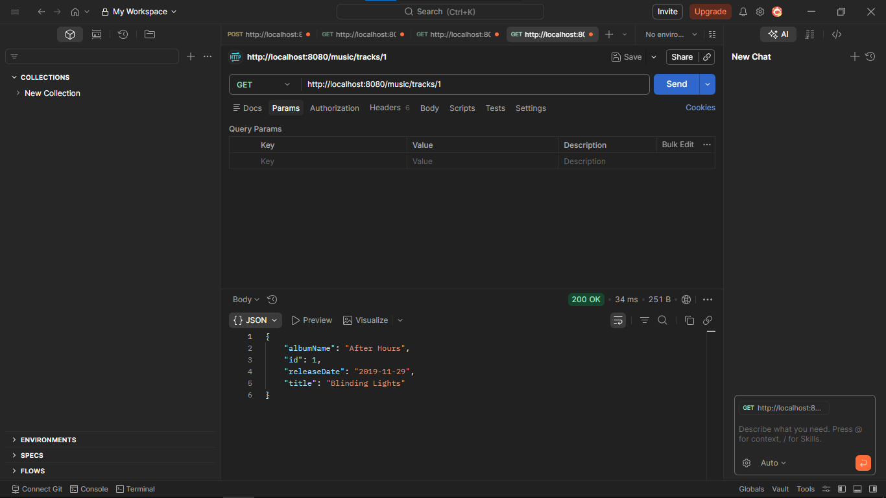
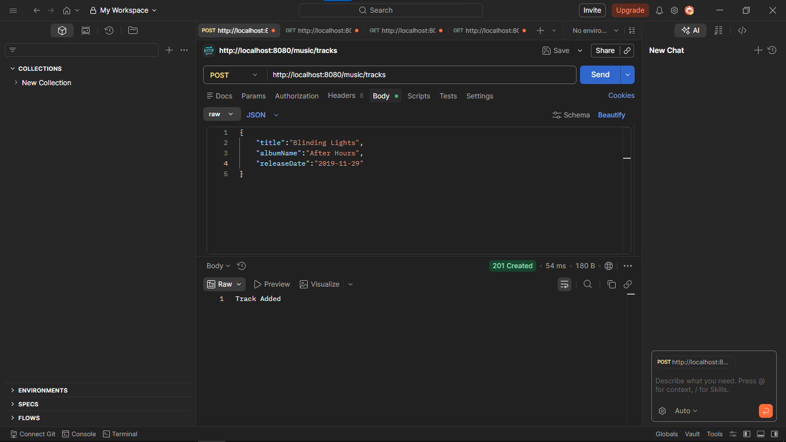
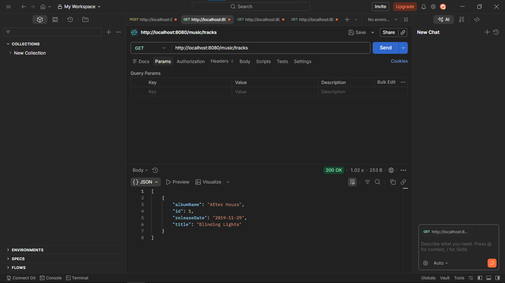
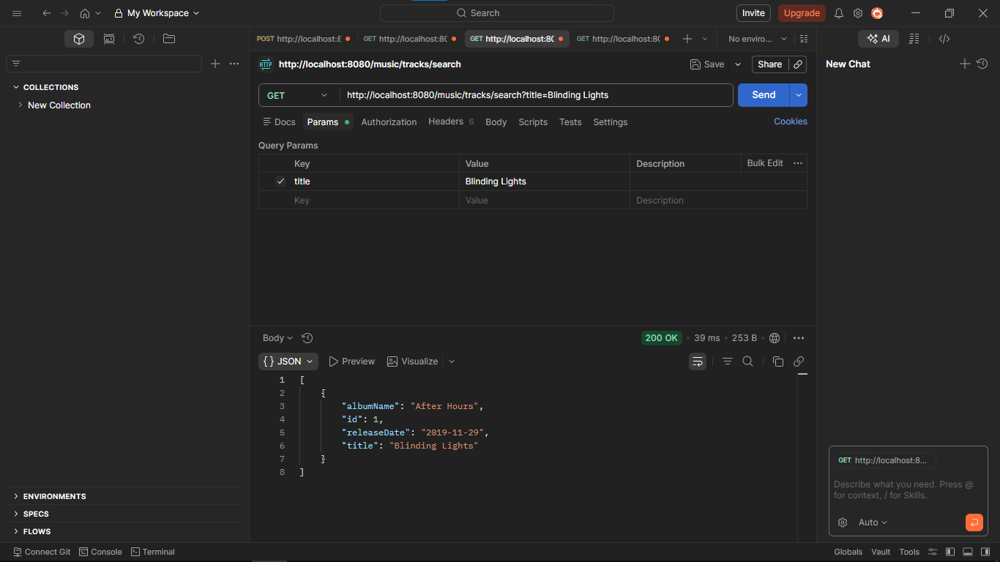
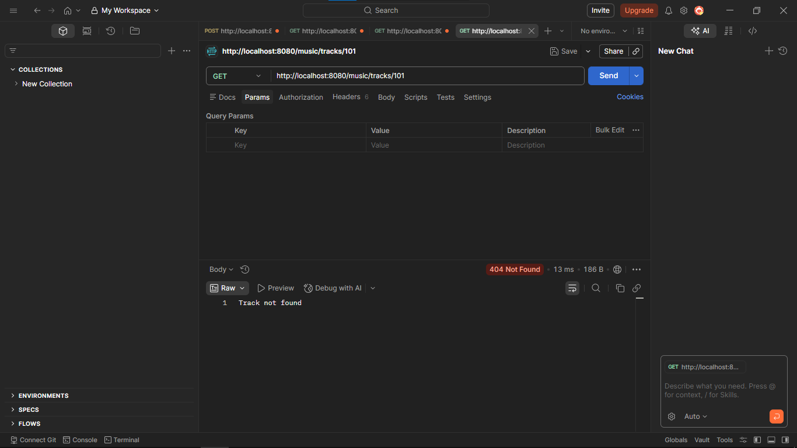

# Spring Rest Music Track API

Spring Boot REST API for managing music tracks.

Created during **Capgemini training on 20 March**.

## Endpoints

Base URL: `/music`

| Method | Endpoint                           | Purpose         |
| ------ | ---------------------------------- | --------------- |
| POST   | /music/tracks                      | Create track    |
| GET    | /music/tracks                      | List tracks     |
| GET    | /music/tracks/{id}                 | Get by ID       |
| GET    | /music/tracks/search?title={title} | Search by title |

## Run

```bash
./mvnw spring-boot:run
```

## Postman Screenshots

### 1. Create Track



### 2. Get All Tracks



### 3. Get Track By ID



### 4. Search Track By Title



### 5. Additional Response


